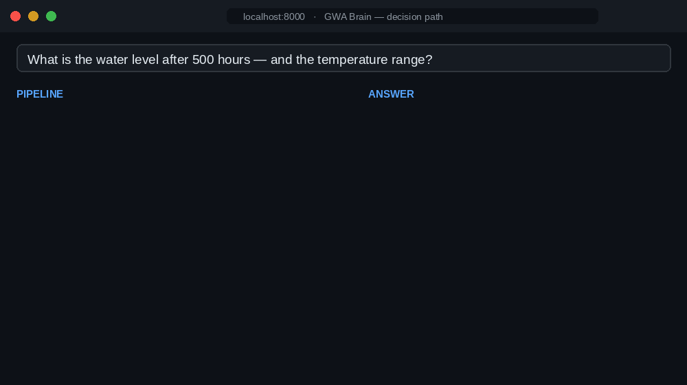
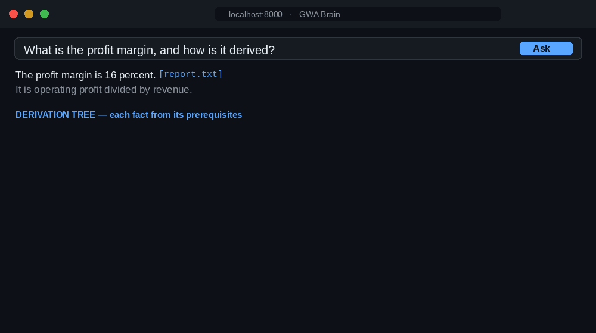

# GWA Brain — Traceable, Grounded Document Q&A

*🌐 Read this in: **English** · [Deutsch](README.de.md)*

[](https://huggingface.co/spaces/carstenfrey/gwa-brain) — **live demo**: ask a sample dataset and watch the decision path.

Ask questions about your documents — and see **why** the system answered the way it did.
Every answer contains **only what's actually in the documents**, with exact citations, the
candidates it **rejected (and why)**, an honest declaration of what isn't covered, and —
for calculations — the full derivation. The goal is a **traceable decision path**, not a
black-box answer.

**GWA** stands for *Global Workspace Agent* — a nod (from the parent research project)
to Global Workspace Theory in cognitive science, where a shared "workspace" is the
common space information is written to and read from. Here that workspace is the
accumulating **brain**: a persistent knowledge store every question reads from and
every answer writes back to.

It talks to **any OpenAI-compatible endpoint** — a hosted API or a local server such as
vLLM / Ollama / TGI — for both chat and embeddings; configure your endpoint and models
in `.env`. One command runs the whole stack: `docker compose up --build`.



*The live **decision path** for one question: each candidate is shown kept or struck
**with a reason**, the answer cites its sources, and the part the documents don't cover is
**declared as a gap** — so you see **how** the answer was reached, and what it honestly
couldn't answer. (Constructed illustration; the struck item is a numeric near-neighbour.)*

---

## TL;DR

- **Traceable answers** — see *why* the system answered this: which sources, which facts it kept, which it **struck (and why)**, and what it couldn't answer.
- **Grounded document Q&A** — answers contain only what's in your docs, with source citations.
- **Gaps are declared, not bluffed** — uncovered parts are named, not hallucinated around.
- **Real fact→fact derivation trees** — for calculations, *how* a number was derived is made explicit.
- **Honest by design:** attested grounding (Stufe 2), not proven; what's *enforced* vs. *instructed* is spelled out; no benchmark in-repo yet.
- **Runs anywhere:** FastAPI + Qdrant + any OpenAI-compatible LLM (hosted or local), one `docker compose up`.

---

## What makes this different — you can trace the answer

Standard RAG gives you an answer; it rarely tells you *why* that answer, or what it
ignored. The point here is an **inspectable decision path**:

- **Every sentence is meant to carry its source** (document, page, paragraph). The
  formulate step is given *only* the facts that survived a guard (enforced) and is
  *instructed* to add nothing beyond them (best-effort — see *Honest reach*).
- **Rejections are visible, with reasons.** A candidate that's topically close but
  answers a *different* question is struck — and shown, with why. You see what was left
  out, not just what made it in.
- **Headings disambiguate entities.** Each fact inherits its document heading as a
  *scope* used for matching, so a fact phrased *"the operating pressure is 3.7 bar"* under
  a *"Pump Station P-12"* heading still answers *"What is the **P-12** pressure?"* —
  deterministically, without rewriting the fact's text (see `demo/`).
- **Gaps are declared, not hallucinated around.** If part of your question isn't
  covered, the answer says so.
- **The graph accumulates.** A fact retrieved for question 3 can directly support
  question 17, and facts that get used together gain weight that **re-ranks future
  retrieval** — it is not just a picture (see *Accumulation*).
- **It shows the reasoning, not just the answer.** Every answer renders a knowledge
  tree; for *derivation* documents that tree is a genuine multi-level dependency chain
  (see *Extraction modes & the dependency tree*).

---

## Honest reach — what this system is, and is not

This system provides **attested grounding** ("belegt"): every shipped sentence traces
to a named source. It does **not** provide **proven grounding** ("bewiesen"): there is
no compiler or oracle that checks whether the document is *correct*. If a document is
wrong, the fact is wrong, and the system won't know.

The guarantee is therefore precise and narrow:

> **"The documents say so — source correctness assumed."**

| ✓ What the pipeline enforces | ✗ What it does NOT guarantee |
|---|---|
| Only guard-kept facts reach the answer step | That the documents are correct |
| Numeric near-neighbours are vetoed and shown | That every printed citation is correct (LLM-instructed) |
| Every uncovered sub-requirement is detected as a gap | Complete answers, or oracle-level proof (no compiler) |

**What's enforced vs. instructed.** The enforced guarantees are structural — only guard-kept facts reach the answer step, Stage B hard-vetoes numeric near-neighbours, every uncovered sub-requirement becomes a declared gap, and accumulation re-ranks retrieval. The parts that depend on the LLM obeying the prompt — **that each sentence actually prints its citation, that nothing outside the supplied facts is added, and that gaps are spelled out in the prose** — are *instructed, best-effort, and not code-validated*. This README never sells the instructed parts as guaranteed.

---

## Retrieval: semantic search, with a deterministic backstop

Most of the time a good embedding model already ranks the right fact first. In a quick
check with bge-m3, the on-target fact sat at **cosine ≈ 0.82** to the question versus
**≈ 0.74** for a numeric look-alike — so it ranked first on its own. But that margin is
**not guaranteed**: it narrows with weaker embedders, longer facts, or closer values, and
the parent research project measured semantic-only recall dropping with composition depth
(about **0.375** on a flat set, **0.167** on a deep one; exact compiler-checkable keying
reaches 1.0/1.0 there — documents have no such key, which is what makes them harder).

So retrieval here is semantic search **plus** a deterministic safeguard — and, just as
importantly, **every step is visible**:

1. **Stage A — broad semantic search** (Qdrant, high recall).
2. **Stage B — term-specificity filter** (no LLM): a candidate that shares a
   qualifier (e.g. *hours*) but carries a *different number* than the requirement is
   flagged a **numeric near-neighbour** and downgraded — never silently substituted.
3. **Stage C — guard** (the chat LLM): hard-vetoes the Stage-B near-neighbours, and for
   every other candidate decides keep/strike on semantic entailment (wrong entity,
   negation, topic drift). In doubt, it strikes — and the reason is shown.

Whatever a sub-requirement can't be covered by after A+B+C is declared a **gap** — no
fuzzy fallback. The value isn't only that a wrong fact is filtered; it's that you can
**see why** each candidate was kept or struck.

---

## Extraction modes & the dependency tree

How a document is turned into facts is chosen per upload (a dropdown in the UI, or the
`mode` field on `/upload/stream`):

| Mode | What it extracts | Tree shape |
|---|---|---|
| **factual** | concrete facts (numbers, units, conditions) — datasheets, reports | star: answer ← evidence |
| **prose** | propositions from narrative / dialogue / prose — letters, literature | star: answer ← evidence |
| **auto** *(default)* | factual first; falls back to prose if a chunk yields nothing | star: answer ← evidence |
| **derivation** | step-by-step calculations/arguments **with their dependencies** | **deep dependency tree** |

In **derivation mode** the model extracts each step *with the earlier steps it uses*
(`depends_on`), building a directed fact→fact DAG. An answer then expands the cited
fact's prerequisite closure, so the knowledge tree is a genuine multi-level chain:

```
Profit margin ─► Operating profit ─► Gross profit ─► Revenue
            │                   │               └─► Cost of goods
            │                   └─► Operating expenses
            └─► Revenue
```



*A derivation run: the answer stays grounded in one cited fact, while the tree shows how
that fact was derived — `Profit margin ← Operating profit ← Gross profit ← {Revenue,
Cost of goods}` — exactly as the document states it. This is traceability for numbers:
not just *what* the result is, but *how* it follows from the inputs.*

This is the honest limit of "a real branched tree": ordinary documents (datasheets,
prose) state **independent** facts, so their tree is a star (answer ← evidence). A deep
fact-from-fact chain only exists when the *content itself* is a derivation — there is no
oracle inventing dependencies (that would be Stufe 1).

---

## Two ideas in depth

### 1. The term-specificity filter (Stage B)

Dense retrieval ranks by embedding cosine. Two facts that differ only in a number under a
shared qualifier — "160 cm after **500** hours" vs. "180 cm after **100** hours" — sit
close in embedding space (here ≈ 0.85 to each other). A strong embedder often still ranks
the right one first; but with a weaker model, longer facts, or closer values that margin
can vanish, and semantic search alone may hand the LLM the wrong one. This stage is the
**deterministic backstop** — and it makes the exclusion **visible**.

It is a small, **no-LLM** stage that runs after broad retrieval. For each sub-requirement
it extracts the **load-bearing quantities** — `(number, qualifier)` pairs whose qualifier
is a recognised unit/condition word, e.g. `('500', 'hours')` (`quantity_terms` in
`gwa/qa/term_filter.py`). Then, per candidate:

- shares the **same** `(number, qualifier)` → **on-target**;
- shares the qualifier but a **different number** → flagged a **numeric near-neighbour**
  (`quantity_conflict`): same topic, wrong value;
- non-numeric requirement → fall back to lexical content-token overlap (≥ 2 shared tokens,
  or ≥ 50 % of the requirement's terms).

A `quantity_conflict` candidate is **hard-vetoed** by the guard (the one thing a purely
lexical stage is reliably good at) and surfaced as a *struck* candidate **with its
reason** — so the exclusion is both deterministic and visible. Everything else is left to
the LLM guard's semantic judgement. That division of labour — **Stage B catches numeric
substitution; the guard catches semantic non-entailment** — mirrors the parent project's
`min_overlap = 2` rule: a single shared (often near-stopword) qualifier must never be
enough to substitute one fact for another.

### 2. Derivation provenance (the deep tree)

For documents that *contain* a derivation — a calculation, a chained argument, a
step-by-step process — the **derivation** extraction mode asks the model to return ordered
steps, each with a `depends_on` list naming the earlier steps whose result it uses
(`parse_steps` in `gwa/ingestion/fact_parser.py`). Those links become a directed
**fact → prerequisite DAG**, stored in the brain next to the undirected co-usage graph
(`add_dependencies` / `dependency_subtree` in `gwa/graph/brain.py`).

When a question is answered, the cited fact's **prerequisite closure** is walked
(`build_tree` in `gwa/qa/pipeline.py`), so the knowledge tree becomes a genuine
multi-level chain — e.g. *Profit margin ← Operating profit ← Gross profit ← {Revenue,
Cost of goods}*. The **answer text stays grounded in the directly-relevant fact**; the
**tree shows how that fact was derived**, exactly as the document states it. This is the
traceability story at its sharpest: a number you can follow back to its inputs.

This is "provenance" in the attested (Stufe-2) sense: the dependencies are **what the text
itself asserts** ("C is A minus B"), not a proof. There is no oracle inventing derivations
— that would be Stufe-1. So ordinary documents (independent facts) yield a flat star, and
only genuine derivation content yields a deep tree.

> **Prototype — executable provenance:** `gwa/codegen.py` turns such a tree into runnable
> Python (one pure function per derived quantity, each citing its source) and verifies it
> against the document's own stated values — *executable* provenance derived from documents
> (the Stufe-1 end, but document-grounded). See [ROADMAP](docs/ROADMAP.md); try
> `python -m gwa.codegen demo/brain.json "profit margin"`.

---

## Architecture

```
            Browser (responsive UI: upload · ask · answer+citations · knowledge tree)
                                  │  HTTP / SSE
        ┌─────────────────────────▼──────────────────────────┐
        │              brain  (FastAPI, Python)               │
        │   /upload/stream  /ask/stream  /graph  /brain/reset │
        │                                                     │
        │   Q&A:  Decompose → Retrieve → Guard → Gap → Form   │
        │            │                       │                │
        │   ┌────────▼────────┐     ┌────────▼─────────┐      │
        │   │ NetworkX        │     │  OpenAI-compat   │      │
        │   │ co-usage +      │     │  LLM endpoint:   │      │
        │   │ derivation DAG  │     │  chat + embed    │      │
        │   │ + brain.json    │     └──────────────────┘      │
        │   └─────────────────┘                               │
        └─────────────────────────┬──────────────────────────┘
                                  │
                ┌─────────────────▼──────────────────┐
                │  qdrant  (vector DB, port 6333)     │
                └─────────────────────────────────────┘
```

- **Qdrant** finds (vector similarity, persistent, production-ready).
- **NetworkX** explains: an undirected **co-usage** graph (which facts were cited
  together — its weights feed back into retrieval ranking) plus a directed
  **derivation** graph (fact→prerequisite, for the deep tree).

---

## Quickstart (Docker)

```bash
cp .env.example .env          # then set your LLM endpoint, API key, and models
docker compose up --build     # uid 1000 by default; see note below for other hosts
# open http://localhost:8000
```

The container runs as a non-root user. Via docker compose it runs as your **host uid**
(default 1000) so files written into `./data` stay yours (cleanable without sudo); if
your host user isn't 1000, run `BRAIN_UID=$(id -u) BRAIN_GID=$(id -g) docker compose up
--build`. (A plain `docker run` without compose uses the image's built-in uid 10001.) The port is
published on **localhost only** by default (no auth — single-user PoC); set
`BRAIN_BIND=0.0.0.0` to expose it on the LAN, and `BRAIN_PORT=8080` if 8000 is busy.
(`BRAIN_BIND`/`BRAIN_PORT` configure Docker Compose's host-side port publishing; for a
direct `python run.py` use `BRAIN_HOST`/`PORT` instead.)

Upload a PDF / Word / text file (pick a mode), ask a question, watch the live pipeline
log and the knowledge tree. The header shows the brain growing: "N facts · M documents".

> Bring your own models: set `LLM_BASE_URL`, `GWA_MODEL`, `GWA_EMBED_MODEL` and the API
> key in `.env`. Any OpenAI-compatible chat + embeddings endpoint works — a hosted API,
> Mistral, or a local server. See `.env.example` for ready-made examples.

## Local development (no Docker)

```bash
python -m venv .venv && . .venv/bin/activate
pip install -r requirements-dev.txt

# offline smoke run — no key, no Qdrant server, deterministic mock backend:
GWA_MOCK=1 QDRANT_LOCATION=:memory: python run.py      # http://localhost:8000

# the test suite (mock LLM + lexical embeddings + in-memory Qdrant):
pytest -q
```

---

## Hosted demo (Hugging Face Space)

A one-Space deployment — a real chat LLM via the Hugging Face router, lexical embeddings, and
the demo brain pre-loaded so it starts instantly — is scaffolded in
[`hf-space/`](hf-space/); see [`hf-space/SETUP.md`](hf-space/SETUP.md). It needs only your
`HF_TOKEN` as a Space secret. (`GWA_EMBED=lexical` runs a real LLM with the zero-dependency
embedder, since the HF router has no embeddings route.)

---

## How it works (the pipeline)

`gwa/qa/pipeline.py` runs, per question:

1. **Decompose** → the concrete sub-requirements an answer must cover (kept literal to
   the question — it does not invent definitions/formulas the question didn't ask for).
2. **Retrieve** → Qdrant top-k per sub-requirement, then the **term-specificity
   filter** (`gwa/qa/term_filter.py`), then the **accumulation re-rank**.
3. **Guard** (`gwa/qa/guard.py`) → numeric near-neighbours are hard-vetoed; every other
   candidate is kept/struck by the LLM. Struck candidates are surfaced with a reason.
4. **Gap check** → any sub-requirement with no kept coverer becomes a declared gap.
5. **Formulate** → cited prose, from kept facts only.
6. **Accumulate** → cited facts gain weight + co-usage edges (see below); for derivation
   docs, the answer's tree expands the cited fact's dependency chain.

Every stage streams to the UI over Server-Sent Events, so the demo *shows* why each
fact is kept or struck — the decision path, live.

## Accumulation (the load-bearing feature)

Every upload grows the brain permanently (facts from document A stay when document B
arrives). Every answer leaves a trace: cited facts gain **weight** and facts cited
together gain a **co-usage edge**. That weight is **functional**, not cosmetic — it
re-ranks future retrieval:

```
final_score = (1 − w)·(0.6·cosine + 0.4·term_specificity) + w·normalized_graph_weight
```

so a frequently co-cited fact outranks an equal-cosine newcomer. A fact from one
question can directly answer a later one, with no re-embedding. (This is what
distinguishes the system from a stateless RAG chat: it has an accumulating, weighted
memory across questions.)

## The guard, honestly

The guard runs on the **same chat model** as the rest of the system (a single-model
guard by default). This is a deliberate, scoped choice:

- The parent research project's guard *ablation* (on its own data) found a cross-model
  guard **byte-identical** to the same-model guard — a second model added nothing there.
- That same ablation registered the semantic guard as **insufficient on its hard suite**
  (precision below the locked 0.85 bar). So this is a **conservative, UNMEASURED product
  guard** — it strikes in doubt and shows what it struck. It is **not** a validated
  guard, and this README makes no measured grounding claim.
- For a *measurement* path you would use distinct models for generator / guard / judge
  to avoid self-grading circularity. An **optional cross-model guard hook** exists for
  that (`GUARD_CROSS_*` in `.env`) but is **off by default** and not part of the demo.

---

## Configuration

All settings are environment variables (see `.env.example`). The important ones:
`LLM_BASE_URL`, `GWA_MODEL`, `GWA_EMBED_MODEL` and the chat API key (named by
`LLM_API_KEY_ENV`), plus `QDRANT_HOST` / `QDRANT_PORT` and `BRAIN_DATA_DIR`. Optional:
`GWA_EXTRACT_MODE`, `GWA_TOP_K`, `GWA_ACCUM_WEIGHT`, the `GUARD_CROSS_*` hook, and
`GWA_MOCK` / `QDRANT_LOCATION` for offline runs.

## Persistence & reset

- **Qdrant embeddings** live in the `qdrant_data` Docker volume — they survive
  `docker compose restart` and `docker compose down` (without `-v`).
- **The graphs + facts + brain.json** live in the host-mounted `./data/` — they survive
  everything except manual deletion. Writes are atomic (temp file + `fsync` + replace).
- **Self-healing:** if the Qdrant volume is wiped but `./data/brain.json` survives
  (e.g. `docker compose down -v`), the app **re-indexes** the facts from their stored
  text on the next start — so search keeps working. Because of this, `down -v` alone is
  *not* a full reset.
- **Full reset:** the "Reset brain" button / `POST /brain/reset`, or delete
  `./data/brain.json` (and `docker compose down -v` for the vectors).

## Limits & safety (PoC scope)

Uploads are capped (`BRAIN_MAX_UPLOAD_BYTES`, default 25 MB) and streamed to disk. The
container runs as a non-root user. There is **no authentication** — the app is bound to
localhost by default; do not expose it on an untrusted network without a reverse proxy
or auth in front. A reasoning model + a tight rate limit makes ingesting large documents
slow; keep demo documents small. Concurrent SSE streams are capped (`GWA_MAX_STREAMS`,
default 16 → excess requests get HTTP 429) and each stream's event buffer is bounded
(drops events to a disconnected/slow client rather than growing unbounded).

## Project layout

```
gwa/
  config.py · deps.py            # settings + client wiring (any OpenAI-compatible endpoint)
  transport.py · llm.py · embedder.py            # OpenAI-compatible HTTP stack (+ batching)
  models.py                      # Fact, Candidate, QAResult
  ingestion/  extractor.py · fact_parser.py · ingest.py   # chunking; factual/prose/auto/derivation extraction
  graph/      brain.py           # Qdrant + NetworkX (co-usage + derivation) + atomic brain.json
  qa/         term_filter.py · retriever.py · guard.py · pipeline.py · prompts.py
  ui/         app.py · static/   # FastAPI + SSE; vanilla HTML/CSS/SVG tree (star + hierarchical)
tests/                           # mock LLM + lexical embeddings + in-memory Qdrant
```

A per-file, per-function walkthrough of the whole codebase is in
[`docs/CODE_GUIDE.md`](docs/CODE_GUIDE.md). Planned/possible enhancements (e.g. optional
chunk overlap, an evaluation benchmark) are noted in [`docs/ROADMAP.md`](docs/ROADMAP.md).

## Scope (MVP)

No multi-user, no auth, no cloud deploy. Single-user demo and a base for later domain
applications. Provider-agnostic (any OpenAI-compatible endpoint); no fuzzy fallback on gaps; struck
candidates always shown; the Stufe-2 ("belegt") guarantee kept honest — never sold as
Stufe-1.

---

*The retrieval numbers attributed to the parent research project (semantic recall 0.375
flat → 0.167 deep; exact keying 1.0/1.0; cosine bands 0.77–0.85 distinct / 0.94–0.95
paraphrase) are from its run artifacts, not measured in this repo. The cosine values for
the water-level example (≈ 0.82 / 0.74 / 0.85) were measured here with bge-m3 on a
constructed illustration. No end-to-end benchmark of GWA Brain exists yet.*

---

## Related work & references

GWA Brain is an engineering **synthesis** of ideas from grounded / attributed question
answering; it does not claim novelty over them. Pointers for context:

- **Retrieval-augmented generation.** Lewis et al., *Retrieval-Augmented Generation for
  Knowledge-Intensive NLP Tasks*, NeurIPS 2020. — Karpukhin et al., *Dense Passage
  Retrieval for Open-Domain QA*, EMNLP 2020.
- **Answers with citations / attribution.** Gao et al., *Enabling Large Language Models to
  Generate Text with Citations* (ALCE), EMNLP 2023. — Bohnet et al., *Attributed Question
  Answering*, 2022. — Gao et al., *RARR: Researching and Revising What Language Models
  Say*, ACL 2023.
- **Knowing when to abstain / declare a gap.** Kadavath et al., *Language Models (Mostly)
  Know What They Know*, 2022. — Yin et al., *Do Large Language Models Know What They Don't
  Know?*, ACL 2023 (Findings).
- **Self-checking / corrective retrieval.** Asai et al., *Self-RAG*, ICLR 2024. — Yan et
  al., *Corrective Retrieval-Augmented Generation (CRAG)*, 2024. — Jiang et al., *Active
  Retrieval-Augmented Generation (FLARE)*, EMNLP 2023.
- **Graph-structured verification & provenance.** Jin et al., *VeriGraph: Towards
  Verifiable Data-Analytic Agents*, arXiv:2606.16603, 2026 — a neuro-symbolic evidence DAG
  in which a conclusion is verifiable iff every claim traces back through the graph to raw
  data; the closest neighbour to GWA Brain's derivation provenance (see below).
- **Surfacing rejected evidence / decision-path interfaces.** *ContextGuard* (open-source
  `llm-contextguard`) — an admission "gate" that rejects chunks with human-readable reason
  codes and exports a trace DAG; the closest neighbour to GWA Brain's *guard mechanism*. —
  *PaperTrail*, CHI 2026 (arXiv:2602.21045) — a claim–evidence interface that also
  surfaces "claims omitted from the answer". — Elicit *Strict Screening* — ships
  rejected-candidates-with-reasons in systematic-review screening. — Hebbia *Matrix* — a
  commercial "system of record for reasoning" that traces analytical steps with citations.
- **Numeric robustness.** *RAGShield: Detecting Numerical Claim Manipulation in Government RAG
  Systems*, arXiv:2604.00387, 2026 — shows embeddings encode topic, not numeric
  precision (a $50k change to a figure still yields cosine ≈ 0.9998), which is exactly why the
  Stage-B filter is **deterministic** rather than a similarity threshold.
- **LLM as a verifier / judge.** Zheng et al., *Judging LLM-as-a-Judge with MT-Bench and
  Chatbot Arena*, NeurIPS 2023.
- **Hallucination, surveyed.** Ji et al., *Survey of Hallucination in Natural Language
  Generation*, ACM Computing Surveys 2023.
- **The name.** Baars, *A Cognitive Theory of Consciousness* (Global Workspace Theory),
  1988; Dehaene, *Consciousness and the Brain*, 2014.

### How GWA Brain differs

These are differences in **enforcement and scope**, not benchmark-proven superiority (the
system ships no evaluation of its own — see *The guard, honestly*):

- **vs. vanilla RAG** — the formulate step is fed *only* guard-kept facts (enforced) and
  is *instructed* to cite them and add nothing else (best-effort, not code-validated).
- **vs. attribution work** (ALCE, RARR, Attributed QA), which mostly *evaluates* or
  *post-hoc revises* citations — here the kept-facts-only input, per-sub-requirement gap
  *detection*, and the Stage-B veto are **enforced in code** (the citation text itself is
  LLM-instructed), and **struck candidates are shown** (you see what was rejected, and why).
- **vs. self-/corrective RAG** (Self-RAG, CRAG, FLARE), which put retrieval/critique
  *inside the LLM's control* (special tokens, a learned critic, the model decides when to
  retrieve or revise) — GWA Brain keeps the guard as a stage the model **cannot skip**
  ("guarded, not trusted"), and adds a **deterministic, non-LLM term-specificity filter**
  aimed squarely at **numeric near-neighbour substitution**, a failure mode general critics
  do not target directly — and one embedding similarity is *blind* to (RAGShield measures
  cosine ≈ 0.9998 for a $50k change), which is why the backstop is deterministic.
- **vs. abstention work** — gaps are declared **per decomposed sub-requirement** from
  coverage, not from a single global confidence threshold.
- **vs. graph-structured verification (VeriGraph)** — the closest neighbour for the
  *derivation tree*. VeriGraph builds a **re-executable, neuro-symbolic** evidence DAG in
  which a conclusion is verifiable iff it traces back to raw data — *proven* provenance,
  effectively **Stufe 1**. GWA Brain's derivation provenance is deliberately lighter: the
  `depends_on` edges are **what the document text asserts**, not re-executable computations
  — *attested* (**Stufe 2**) provenance over **arbitrary documents**, with no code execution
  and no oracle. It trades VeriGraph's verifiability for generality and simplicity, and says
  so.
- **vs. rejected-evidence UIs & decision-path products** — *showing* discarded candidates is
  not unique either. *ContextGuard* pairs reject-with-reason + a trace DAG but is a v0.1
  developer library (no end-user answer UI, gap declaration, or citations); Elicit *Strict
  Screening* ships rejected-with-reasons, but for literature screening, not general QA;
  *PaperTrail* unifies grounding and an omitted-claims surface in one UI, but shows omitted
  *source* claims (not rejected *retrieval candidates* with a discard reason) and has no
  derivation tree; Hebbia *Matrix* is the closest commercial "decision path" but traces
  executed steps, not rejected candidates, gaps, or a numeric derivation DAG, and is
  closed-source.

So the genuinely distinctive pieces — distinctive **in combination**, not as inventions — are: (1) an **inspectable decision path** — every
kept/struck candidate shown with a reason, gaps declared, and (for calculations) the
derivation made explicit; (2) **document-stated derivation provenance** rendered as a deep
tree; (3) a deterministic **term-specificity filter** as a backstop against numeric
near-neighbour substitution; over (4) an **accumulating co-usage graph** that re-ranks
future retrieval. None of these is benchmarked here.

---

## License

Apache License 2.0 — © 2026 Carsten Frey. See [LICENSE](LICENSE) and [NOTICE](NOTICE).
