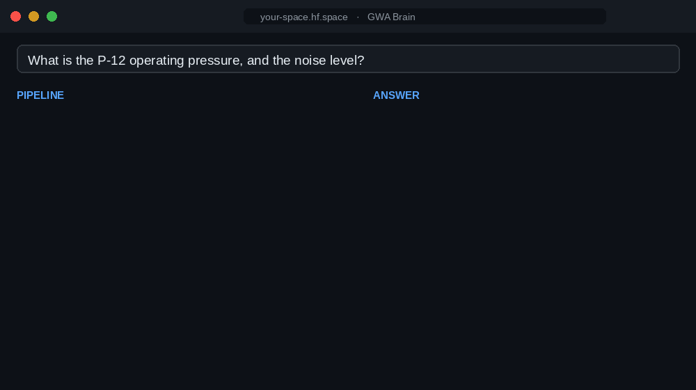

# GWA Brain — traceable document Q&A (demo)

Ask questions about the pre-loaded sample documents and see **why** the system answers the
way it does: every sentence is source-cited, rejected candidates are shown **with a reason**,
gaps are declared, and calculations render a derivation tree.

Try, for example: *"What is the P-12 operating pressure?"*, *"How much does the P-12 weigh?"*,
*"What is the profit margin, and how is it derived?"*, or something the documents don't cover
(*"What is the noise level in decibels?"* → declared as a gap).

**About this demo backend**

- The chat model runs via an OpenAI-compatible provider (the **Hugging Face Inference
  router** by default; any provider works).
- Retrieval uses the lightweight **lexical** embedder (no embeddings endpoint needed),
  so search is keyword-ish — fine for this curated sample, weaker than a dense embedder.
- It runs on a **free** tier (rate/credit-limited); a busy moment may hit the limit. It is a
  proof-of-concept with **no authentication**.

**Test it with your own model** — click **⋮ → Duplicate this Space** (top-right) and set your
own `HF_TOKEN` (or any OpenAI-compatible `LLM_BASE_URL` / `GWA_MODEL` / key) as Space secrets.
It then runs on *your* account, not the original's — no cost to anyone else.

Source code, design notes and the full README: **https://github.com/cfrey-de/gwa-brain**
